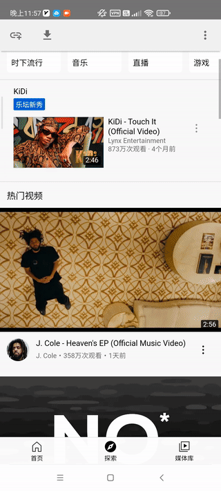

Este projeto foi interrompido, por favor, acompanhe as atualizações https://github.com/grandiloquent/91porn-client

# Navegador de vídeos

Um aplicativo para dispositivos Android que permite a análise e o download de vídeos de várias plataformas.

## Histórico de atualizações

* 1.1.5

    * Melhorias na lógica de reprodução de vídeos já baixados.

* 1.1.4

    * Correção de bugs ao baixar vídeos.

* 1.1.3

    * Melhorias na lógica de download de vídeos no formato m3u8.
    * Baixe vídeos das plataformas 91porn, 57ck e xvideos, salvando os arquivos com seus respectivos títulos, para facilitar a identificação.

## Plataformas de vídeo suportadas

* [x] [Kuaishou](https://m.kuaishou.com/)
* [x] [Douyin](https://www.douyin.com/)
* [x] [TikTok](https://www.tiktok.com/)
* [x] [AcFun](https://www.acfun.cn/): Um site de vídeos com comentários em tempo real
* [x] [iQiyi](https://m.iqiyi.com/)
* [x] [Bilibili](https://www.bilibili.com/)
* [x] [Mango TV](https://mgtv.com/)
* [x] [Tencent Video](https://v.qq.com/)
* [x] [Xigua Video](https://m.ixigua.com/)
* [x] [CCTV](https://tv.cctv.com/m/index.shtml)
* [x] [Twitter](https://m.twitter.com)
* [x] [YouTube](https://m.youtube.com)
* [x] [91porn](https://91porn.com/index.php): Download de vídeos em massa
* [x] [XVideos](https://xvideos.com)
* [x] [PornHub](https://www.pornhub.com)
* [x] [PornOne](https://pornone.com/)
* [x] http://57ck.cc/
* [x] [Pesquisar vídeos](http://47.106.105.122)

## Membro do Tencent Video

Baixe e instale o aplicativo móvel **Tencent Meeting**, vincule seu e-mail através da opção de benefícios para receber *"7 dias de associação ao Tencent Video.**

Após fazer login no Tencent Video através do navegador, pressione a tecla F12, vá para a guia 'Console', cole o código document.cookie, pressione Enter, copie a sequência de caracteres entre as aspas simples e cole-a no software correspondente para baixar vídeos do Tencent Video.

## Método de uso

* Abrir a página de vídeo e clicar no vídeo para reproduzi-lo automaticamente com resolução sem prejudicar a experiência
* Abra a página onde o vídeo está localizado e clique no botão de download na parte superior para iniciar a análise/extracção."

Quanto aos diretórios de armazenamento mencionados, eles são:

*/storage/emulated/0/Download*
*/storage/emulated/0/Android/data/euphoria.psycho.explorer/files/Download*

*Devido às políticas de armazenamento mais restritas nas novas versões do Android, é possível acessar os arquivos de vídeo na pasta "/storage/emulated/0/Android/data/euphoria.psycho.explorer/files/Download" conectando o dispositivo Android ao computador por meio de um cabo de dados. Dessa forma, você poderá visualizar e transferir os arquivos de vídeo para o computador*

## Download do programa

* [Exemplo](https://github.com/grandiloquent/VideoBrowser/releases)
* [Nacional](https://lucidu.cn/article/jqdkgl)

## Referências 

* https://github.com/HaarigerHarald/android-youtubeExtractor
* https://github.com/soarcn/BottomSheet
* https://github.com/google/volley
* https://github.com/Tencent/rapidjson
* https://github.com/yhirose/cpp-httplib
* https://github.com/openssl/openssl
* https://github.com/google/brotli

## Como baixar vídeos do TikTok?

1. Copie o link compartilhado do vídeo ou o endereço da página do aplicativo ou site do TikTok, algo como:

        https://vm.tiktok.com/ZSJkHUCwK/
        https://www.tiktok.com/@travelscenerykj/video/6990367736601922822

2. Clique no botão de adicionar link no canto superior esquerdo.
3. Cole o link compartilhado do vídeo ou o endereço da página na entrada e, em seguida, clique no botão "OK".

## Problemas

* Se você não conseguir baixar vídeos de algumas páginas, tente atualizar a página usando o menu.
* Se você encontrar vídeos que não podem ser analisados, tente novamente ou envie um feedback através deste [link](http://lucidu.cn/feedback) para relatar o problema.
